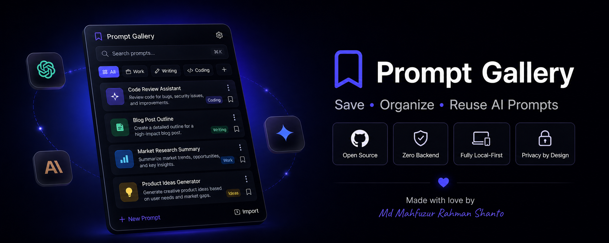
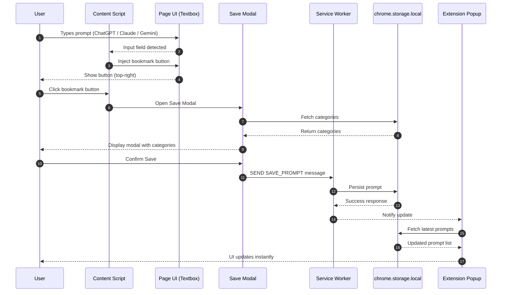

<div align="center">

<!-- Replace with your actual banner image once generated -->


<br/>


# Prompt Gallery

**Save, organize, and reuse AI prompts — right from your browser.**

A fast, minimal Chrome extension that lives inside ChatGPT, Claude, Gemini, Perplexity, and Grok. One click saves any prompt to your personal library. One click brings it back.

[](./LICENSE)
[](https://developer.chrome.com/docs/extensions/)
[](https://react.dev)
[](https://www.typescriptlang.org/)

</div>

---

## Why Prompt Gallery?

You spend time crafting the perfect prompt. Then you lose it. You rewrite it the next day, and the day after that.

Prompt Gallery keeps your best prompts one click away — organized, searchable, and ready to insert directly into any AI conversation.

---

## Features

| Feature | Description |
|---|---|
| **Native Save Button** | A bookmark icon appears inside the AI text box as you type — just like a native button |
| **Instant Insert** | Copy to clipboard or inject the prompt directly into the active AI input field |
| **Smart Organization** | Categories, tags, and real-time fuzzy search across your entire library |
| **Local-First** | All data lives on your device via `chrome.storage.local` — no account required |
| **Gallery View** | Switch between list and card grid layouts |
| **Full Category Control** | Add, rename, and delete categories with instant sync across the popup |
| **Import / Export** | One-click JSON backup and restore |
| **Dark / Light / System** | Follows your OS preference or set it manually |
| **Keyboard Shortcut** | `Ctrl+Shift+P` / `⌘+Shift+P` to open the popup from anywhere |

---

## Supported AI Sites

| Site | URL |
|---|---|
| ChatGPT | chatgpt.com · chat.openai.com |
| Claude | claude.ai |
| Gemini | gemini.google.com |
| Perplexity | perplexity.ai |
| Grok | grok.x.ai · grok.com |

---

## How It Works



---

## Getting Started

### Install from Source

```bash
# 1. Clone the repository
git clone https://github.com/mahfuzswe/prompt-gallery.git
cd prompt-gallery

# 2. Install dependencies
npm install

# 3. Build the extension
npm run build
```

### Load in Chrome

1. Open **Chrome** → navigate to `chrome://extensions`
2. Enable **Developer mode** (top-right toggle)
3. Click **Load unpacked**
4. Select the `dist/` folder

The extension icon will appear in your toolbar. Pin it for quick access.

---

## Development

```bash
npm run dev          # watch mode — rebuilds on file changes
npm run build        # production build → dist/
npm run type-check   # TypeScript strict check (no emit)
npm test             # run unit tests with Vitest
```

### Project Structure

```
prompt-gallery/
├── src/
│   ├── popup/          # React SPA — browse, search, add, edit prompts
│   │   ├── App.tsx
│   │   ├── store.ts    # Zustand global state
│   │   ├── api.ts      # Message-passing wrappers
│   │   └── components/
│   ├── content/        # Injector — save button + save modal on AI pages
│   │   ├── index.ts
│   │   ├── injector.ts # Core detection & injection logic
│   │   └── content.css
│   ├── background/     # Service worker — message relay + storage ops
│   │   └── service-worker.ts
│   ├── storage/        # Data layer
│   │   └── promptStore.ts  # CRUD over chrome.storage.local
│   └── shared/
│       └── types.ts    # Shared TypeScript interfaces
├── public/
│   └── icons/          # Extension icons (16, 48, 128 px)
├── manifest.json       # Chrome Extension Manifest V3
└── vite.config.ts
```

---

## Tech Stack

| Layer | Technology |
|---|---|
| UI Framework | React 18 + TypeScript |
| Build Tool | Vite 6 + vite-plugin-web-extension |
| Styling | Tailwind CSS v4 |
| State Management | Zustand |
| Search | Fuse.js (fuzzy search) |
| Icons | Lucide React |
| Storage | chrome.storage.local (Manifest V3) |
| Testing | Vitest + Playwright |

---

## Contributing

Contributions are welcome! Here's how to get started:

1. **Fork** the repository
2. **Create** a feature branch: `git checkout -b feat/your-feature`
3. **Commit** your changes: `git commit -m "feat: add your feature"`
4. **Push** and open a **Pull Request**

Please follow the existing code style (TypeScript strict mode, no `any`, descriptive variable names) and keep components small and focused.

---

## License

This project is licensed under the **MIT License** — see the [LICENSE](./LICENSE) file for details.

You are free to use, modify, distribute, and build on this software for personal and commercial projects.

---

## Acknowledgements

Built with love for the AI power-user community. Inspired by tools like [Raycast](https://www.raycast.com/) and [Notion](https://www.notion.so/) — fast, minimal, and respectful of your workflow.

---

<div align="center">

Made on Earth by [Md Mahfuzur Rahman Shanto](https://github.com/mahfuzswe) · Star ⭐ if you find it useful!

</div>
